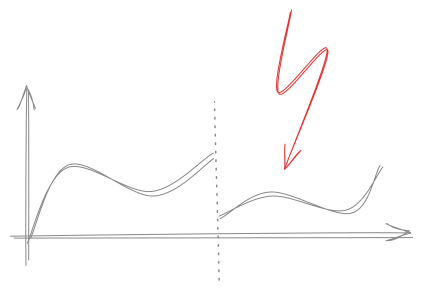

# Begriffe

## Symbole

|   Symbol   |      Bedeutung                   |
|------------|----------------------------------| 
| $\forall$  | *für alle Elemente*              |
| $\exists$  | *es existiert ein*               |
| $\exists!$ | *es existiert genau ein*         |
| $\nexists$ | *es existiert kein*              |
| $a \in A $ | *$a$ ist in Menge $A$ enthalten* |

$\forall$, $\exists$ und $\exists!$ nennt man **Quantoren**.

## Funktion

Eine Funktion $f$ bildet $A$ nach $B$ ab.  
Wir schreiben:

$f: A \to B$  
zum Beispiel: $f: \mathbb{N} \to  \mathbb{N}$

### Surjektivität:

Jedes Element tritt mindestens ein Mal in der Wertemenge $\mathbb{W}$ auf.   
Das ist für $f(x) = x^2$ nicht der Fall, da z.B. $y = -2$ nicht auftaucht.

### Inketivität

Jededs $y \in \mathbb{W}$ ist höchstens eine Lösung zu $x \in \mathbb{D}$.  
$f(x) = x^2$ ist nicht injektiv, da z.B $y=4$ bei $x=-2$ und $x=2$ auftaucht.

### Bijektibität
Eine Funktion ist bijektiv, wenn sie sowohl surjektiv als auch injkektiv ist.

### Monotonie
Eine Funktion ist monoton, wenn sie stetig wächst oder gleich bleibt.

### Stetigkeit

Eine Funktion ist stetig, wenn linker und rechter Grenzwert übereinstimmen und diesem Wert auch der Funktionswert entspricht. (Wenn sie keine Sprünge hat und man ihren Graphen ohne Absetzen zeichnen kann.) 
Zum Beispiel:

