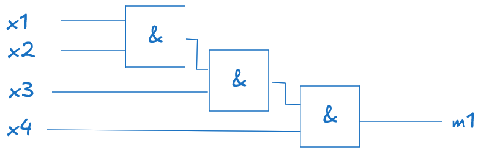
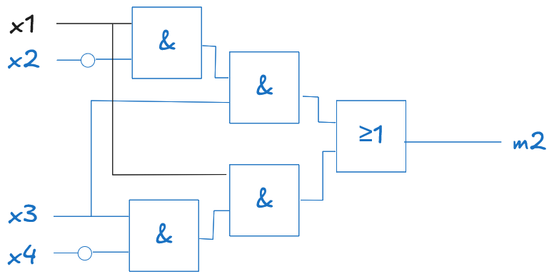
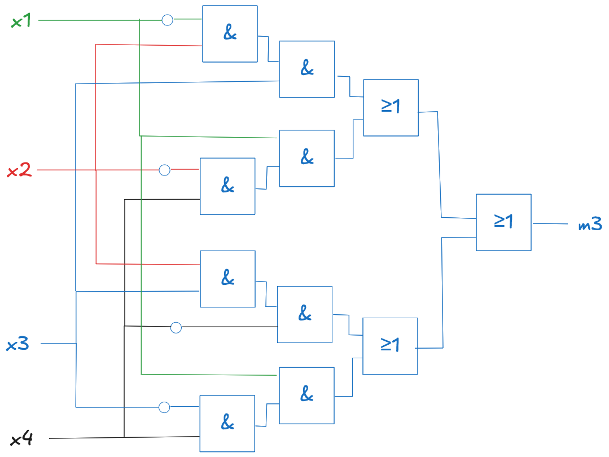
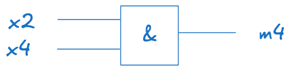

# Lösungen zur Übung zum 16.06.2026

Bearbeitende:

- Niko König
- Ullrich Löblein

## Aufgabe 1

Seien $M$ Minterme.

Minterme: 

0. $M(0,0,0) = \bar x_1 \bar x_2 \bar x_3$
1. $M(0,0,1) = \bar x_1 \bar x_2 x_3$
2. $M(0,1,0) = \bar x_1 x_2 \bar x_3$
3. $M(0,1,1) = \bar x_1 x_2 x_3$
4. $M(1,0,0) = x_1 \bar x_2 \bar x_3$
5. $M(1,0,1) = x_1 \bar x_2 x_3$
6. $M(1,1,0) = x_1 x_2 \bar x_3$
7. $M(1,1,1) = x_1 x_2 x_3$

DNF: $(\bar x_1 x_2 \bar x_3) + (x_1 \bar x_2 \bar x_3) + (x_1 x_2 x_3)$

## Aufgabe 2

Seien $M$ Maxterme.

### Tabelle 1

Maxterme:

0. $M(0,0) = x_1 + x_2$
1. $M(0,1) = x_1 + \bar x_2$
2. $M(1,0) = \bar x_1 + x_2$
3. $M(1,1) = \bar x_1 + \bar x_2$

Für $K$ benötigte Maxterme:

0. $M(0,0) = x_1 + x_2$
1. $M(0,1) = x_1 + \bar x_2$
3. $M(1,1) = \bar x_1 + \bar x_2$

KNF $K$: $(x_1 + x_2)(x_1 + \bar x_2)(\bar x_1 + \bar x_2)$

### Tabelle 2

Maxterme:

0. $M(0,0) = x_1 + x_2$
1. $M(0,1) = x_1 + \bar x_2$
2. $M(1,0) = \bar x_1 + x_2$
3. $M(1,1) = \bar x_1 + \bar x_2$

Für $K$ benötigte Maxterme:

1. $M(0,1) = x_1 + \bar x_2$
2. $M(1,0) = \bar x_1 + x_2$

KNF $K$: $(x_1 + \bar x_2)(\bar x_1 + x_2)$

### Tabelle 3

0. $M(0,0,0) = x_1 + x_2 + x_3$
1. $M(0,0,1) = x_1 + x_2 + \bar x_3$
2. $M(0,1,0) = x_1 + \bar x_2 + x_3$
3. $M(0,1,1) = x_1 + \bar x_2 + \bar x_3$
4. $M(1,0,0) = \bar x_1 + x_2 + x_3$
5. $M(1,0,1) = \bar x_1 + x_2 + \bar x_3$
6. $M(1,1,0) = \bar x_1 + \bar x_2 + x_3$
7. $M(1,1,1) = \bar x_1 + \bar x_2 + \bar x_3$

Für $K$ benötigte Maxtermne:

0. $M(0,0,0) = x_1 + x_2 + x_3$
3. $M(0,1,1) = x_1 + \bar x_2 + \bar x_3$
5. $M(1,0,1) = \bar x_1 + x_2 + \bar x_3$
7. $M(1,1,1) = \bar x_1 + \bar x_2 + \bar x_3$

KNF $K$: $(x_1 + x_2 + x_3)(x_1 + \bar x_2 + \bar x_3)(\bar x_1 + x_2 + \bar x_3)(\bar x_1 + \bar x_2 + \bar x_3)$

## Aufgabe 3

$$
\begin{array}{cccc|c|c|c|c}
x_1 & x_2 & x_3 & x_4 & m_1 & m_2 & m_3 & m_4 \\
\hline
0 & 0 & 0 & 0 & 0 & 0 & 0 & 0 \\
0 & 0 & 0 & 1 & 0 & 0 & 0 & 0 \\
0 & 0 & 1 & 0 & 0 & 0 & 0 & 0 \\
0 & 0 & 1 & 1 & 0 & 0 & 0 & 0 \\
0 & 1 & 0 & 0 & 0 & 0 & 0 & 0 \\
0 & 1 & 0 & 1 & 0 & 0 & 0 & 1 \\
0 & 1 & 1 & 0 & 0 & 0 & 1 & 0 \\
0 & 1 & 1 & 1 & 0 & 0 & 1 & 1 \\
1 & 0 & 0 & 0 & 0 & 0 & 0 & 0 \\
1 & 0 & 0 & 1 & 0 & 0 & 1 & 0 \\
1 & 0 & 1 & 0 & 0 & 1 & 0 & 0 \\
1 & 0 & 1 & 1 & 0 & 1 & 1 & 0 \\
1 & 1 & 0 & 0 & 0 & 0 & 0 & 0 \\
1 & 1 & 0 & 1 & 0 & 0 & 1 & 1 \\
1 & 1 & 1 & 0 & 0 & 1 & 1 & 0 \\
1 & 1 & 1 & 1 & 1 & 0 & 0 & 1 \\
\end{array}
$$

Ich wähle für alle Resultatbits die DNF, da wir 16 mögliche resultate haben und jedes Resultatbit für weniger als 8 Minterme wahr ist.

1. $m_1 = (x_1 x_2 x_3 x_4)$ (DNF)
2. $m_2 = (x_1 \bar x_2 x_3 \bar x_4) + (x_1 \bar x_2 x_3 x_4) + (x_1 x_2 x_3 \bar x_4)$ (DNF)
    * Vereinfacht: $(x_1 \bar x_2 x_3 \bar x_4) + (x_1 \bar x_2 x_3 x_4) =  (x_1 \bar x_2 x_3)$
    * Vereinfacht: $(x_1 \bar x_2 x_3 \bar x_4) + (x_1 x_2 x_3 \bar x_4) = (x_1 x_3 \bar x_4)$
    * Also gesamt vereinfacht: $(x_1 \bar x_2 x_3) + (x_1 x_3 \bar x_4)$
3. $m_3 = (\bar x_1 x_2 x_3 \bar x_4) + (\bar x_1 x_2 x_3 x_4) + (x_1 \bar x_2 \bar x_3 x_4) + (x_1 \bar x_2 x_3 x_4) + (x_1 x_2 \bar x_3 x_4) + (x_1 x_2 x_3 \bar x_4)$ (DNF)
    * Vereinfacht: $(\bar x_1 x_2 x_3 \bar x_4) + (\bar x_1 x_2 x_3 x_4) =  (\bar x_1 x_2 x_3)$
    * Vereinfacht: $(x_1 \bar x_2 \bar x_3 x_4) + (x_1 \bar x_2 x_3 x_4)  = (x_1 \bar x_2 x_4)$
    * Vereinfacht: $(\bar x_1 x_2 x_3 \bar x_4) + (x_1 x_2 x_3 \bar x_4) =(x_2 x_3 \bar x_4)$
    * Vereinfacht: $(x_1 \bar x_2 \bar x_3 x_4) + (x_1 x_2 \bar x_3 x_4) = (x_1 \bar x_3 x_4)$
    * Also gesamt vereinfacht: $(\bar x_1 x_2 x_3) + (x_1 \bar x_2 x_4) + (x_2 x_3 \bar x_4) + (x_1 \bar x_3 x_4)$

4. $m_4 = (\bar x_1 x_2 \bar x_3 x_4) + (\bar x_1 x_2 x_3 x_4)  + (x_1 x_2 \bar x_3 x_4) + (x_1 x_2 x_3 x_4)$ (DNF)
    * Vereinfachung: $(\bar x_1 x_2 \bar x_3 x_4) + (\bar x_1 x_2 x_3 x_4) = (\bar x_1 x_2 x_4)$
    * Vereinfachung: $(x_1 x_2 \bar x_3 x_4) + (x_1 x_2 x_3 x_4) = (x_1 x_2 x_4)$
    * Vereinfachung: $(\bar x_1 x_2 x_4) + (x_1 x_2 x_4) = (x_2 x_4)$
    * Also gesamt vereinfacht: $(x_2 x_4)$

