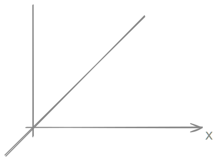

# 1. Motivation
- Grundlage der abstrakten Mathematik
- Sprache und Handwerkszeug für viele Anwendungen (Ingeneure, Naturwissenschaften, WIrtschaftswissenschaften, ...)
- Lineare mathematische Modelle lassen sich einfach behandeln. Nicht lineare Modelle lassen sich durch lineare Modelle approximieren.

Lineares Modell:  


$f(x) = x$  
$f:\mathbb{R} \to \mathbb{R}$  
ist ein lineares Modell.


## 1.1. Ausgangspunkt: Lineare Gleichungssysteme

```math
3x_1 + 2x_2 + 1x_3 = 39  \\
2x_1 + 3x_2 + 1x_3 = 34  \\
1x_1 + 2x_2 + 3x_3 = 26  \\
```

Wobei $x_1$ der Preis eines Bündels guten Getreides entspricht, $x_2$ eines mittleren und $x_3$ eines schlechten.

### Vektor
```math
\begin{pmatrix}
x_1 \\ x_2 \\ x_3
\end{pmatrix}
```
### Matrix-Vetkorform

$Ax = b$

```math
\underbrace{
\begin{pmatrix}
3 & 2 & 1 \\
2 & 3 & 1 \\
1 & 2 & 3
\end{pmatrix}
}_{\text{A: Matrix (2-dimensional)}}
\;
\underbrace{
\begin{pmatrix}
x_1 \\
x_2 \\
x_3
\end{pmatrix}
}_{\text{x: Vektor (1-dimensional)}}
=
\underbrace{
\begin{pmatrix}
39 \\
34 \\
26
\end{pmatrix}
}_{\text{b: Vektor (1-dimensional)}}
```

Zentrales Objekt der linearen Algebra ist das lineare Gleichungssystem (LGS).

**Wichtige Fragen**  
- Existiert eine Lösung?
- Ist die Lösung eindeutig?
- Falls Lösungen existieren, wie kann man sie ausrechnen?

## 1.2. Zentrale Gleichung der linearen Algebra und ihre Anwendungen

a) $Ax=b$  
**LGS: Lösbarkeit, Lösungsmethoden**  
ANwendung in allen Lebensbereichen, z. B. Numerik, Optimierung, Stochastik

b) $A^T Ax=A^T b$  
**Lineare Ausgangsgleichung**  
Gewinung mathematischer Modelle aus Messungen, Daten, Beobachtungen

c) $Ax = \lambda x, \lambda \in \mathbb{R}$  
**Eigenwertsproblem**  
Internetsuchmaschinen, Datenkopmression, Schwingungsanalysen technischer Bauteile

d) $\frac{d}{dt} u(t) = u'(t) = Au(t)$  
**lineare Differentialgleichung**  
Dynamische Systeme in Biologie, Physik, Technik, Ökonomie, ...