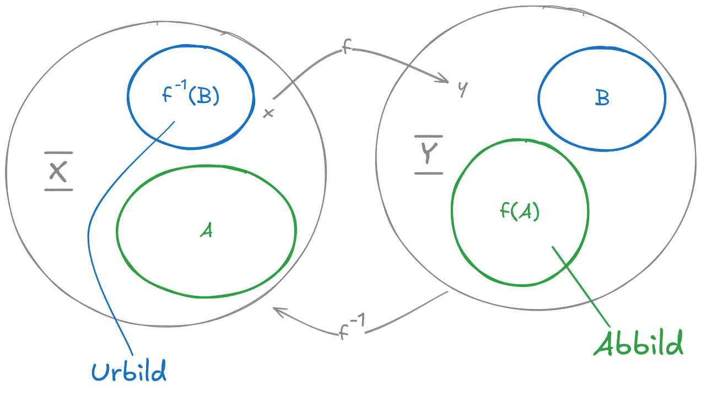
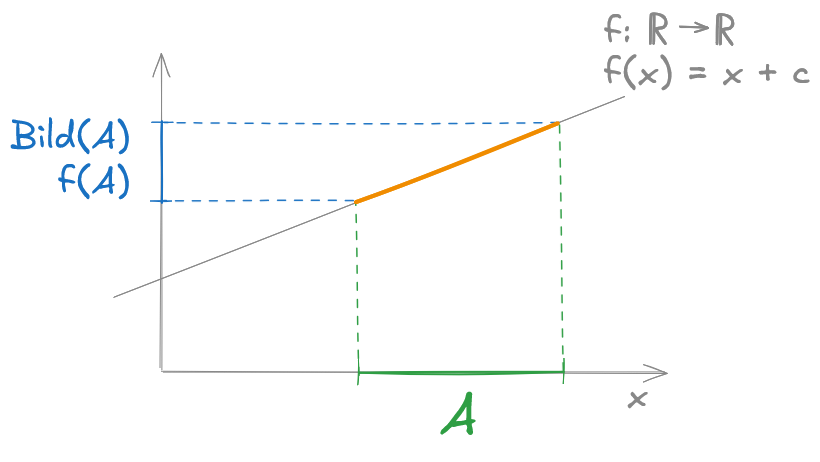
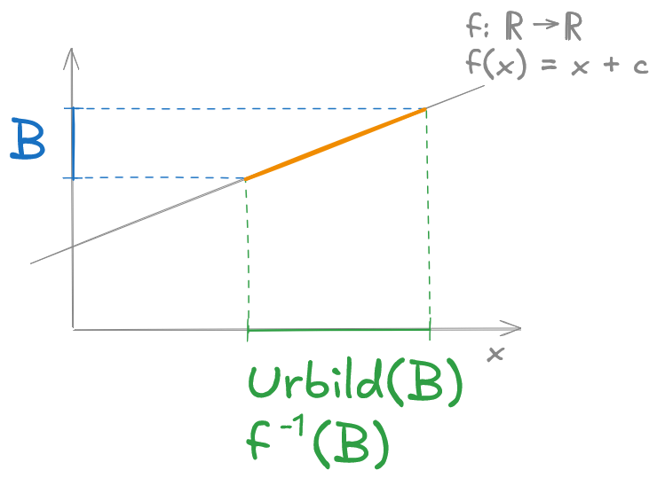
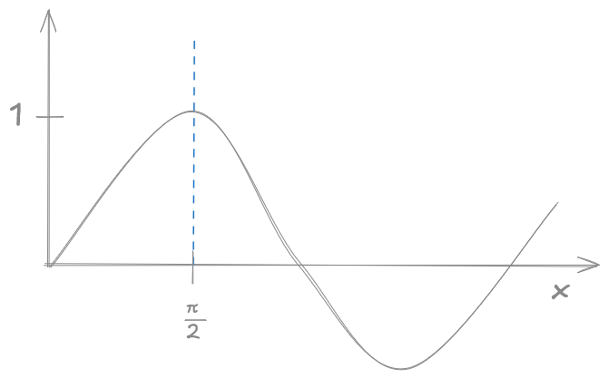
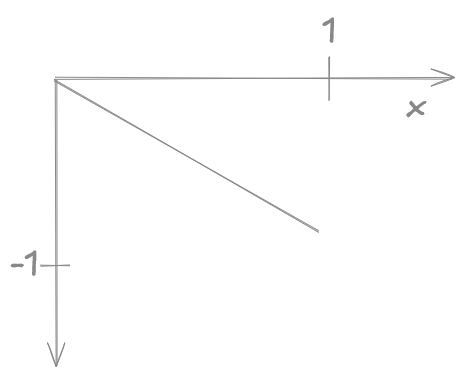

# 2. Grundbegriffe: Aussagenlogik, Mengen, Abbildungen

## 2.1. Aussagenlogik

Sei $A$ eine Aussage, z. B. "Es regnet!". Eine Aussage ist entweder wahr ($1$) oder falsch ($0$).

**Definition**: logisches "und", "oder" und "nicht"  
Wir definieren durch die folgenden Wahrheitstabellen die Verknüpfungen von Aussagen:  
$\land$ ("und zugleich")  
$\lor$ ("oder" im Sinne von mindestens eine von beiden Aussagen ist wahr")  
$\lnot$ ("nicht")

a) **Konjunktion** ("und") $A \land B$  
|$A$|$B$|$A\land B$|
|---|---|----------|
| 1 | 1 |  1       |
| 0 | 1 |  0       |
| 1 | 0 |  0       |
| 0 | 0 |  0       |


b) **Disjunktion** ("oder") $A \lor B$  
|$A$|$B$|$A\lor B$|
|---|---|----------|
| 1 | 1 |  1       |
| 0 | 1 |  1       |
| 1 | 0 |  1       |
| 0 | 0 |  0       |

c) **Negation** ("nicht") $A \lnot B$  
|$A$|$\lnot A$|
|---|---|
| 1 | 0 |
| 0 | 1 |

<small>*(Vorlesung vom 15.04.26)*</small>
  
Es lassen sich komplexere Verknüpfungen bilden

|$A$|$\lnot A$|$A \land \lnot A$|$A \lor \lnot A$|
|-|-|-|-|
|1|0|0|1|
|0|1|0|1|

**Satz:**

Es gelten die folgenden Rechenregeln für alle die Aussagen A, B, C:

a) $A \land B = B \land A$ (Kommutativität)  
b) $A \lor B = B \lor A$ (Kommutativität)  
c) $A \land (B \land C) = (A \land B) \land C$ (Assoziativität)  
d) $A \lor (B \lor C) = (A \lor B) \lor C$ (Assoziativität)    
e) $A \lor (B \land C) = (A \lor B) \land (A \lor C)$ (Distributivität)  
f) $A \land (B \lor C) = (A \land B) \lor (A \land C)$ (Distributivität)  
g) $\lnot (A \lor B) = \lnot A \land \lnot B$  
h) $\lnot (A \land B) = \lnot A \lor \lnot B$ 

Das Symbol $=$ ist im Sinne der Gleichheit der Einträge der Wahrheitstabelle zu verstehen.

**Beweis:**

zu a)

|$A$|$B$|$A \land B$|$B \land A$|
|-|-|-|-|
|1|1|1|1|
|1|0|0|0|
|0|1|0|0|
|0|0|0|0|

...

zu g)

|$A$|$B$|$A \lor B$|$\lnot (A \lor B)$|$\lnot A$|$\lnot B$|$\lnot A \land B$|
|-|-|-|-|-|-|-|
|1|1|1|0|0|0|0|
|1|0|1|0|0|1|0|
|0|1|1|0|1|0|0|
|0|0|0|1|1|1|1|
| | | |*| | |*|

### Definition: Aus A folgt B

"Aus A folgt B": $A \Rightarrow B$

**Feststellung:**  
Im Fall, dass A wahr und B gleichzeitig unwahr ist, ist die Folgerung $A \Rightarrow B$ sicherlich falsch.

Wir definieren: $(A \Rightarrow B) := \lnot (A \land \lnot B) = \lnot A \lor B$

### Defintion: Logische Modi

a) $(A \Rightarrow B) := \lnot A \lor B$ heißt **modus ponens**  
*(heißt, wenn $\lnot A \lor B$ wahr ist, darf ich $A \Rightarrow B$ folgern)*

b) Die Schlussregel $(\lnot B \Rightarrow \lnot A)$ heißt **modus tollens**

### Definition: Äquivalenz von Aussagen
Die Aussagen A und B sind **gleich** oder **äquivalent**, wenn $A \Rightarrow B$ und $B \Rightarrow A$ gilt. Wir schreiben: $A \Leftrightarrow B$

**Satz:**

$(A \Rightarrow B) \Leftrightarrow (\lnot B \Rightarrow \lnot A)$

**Beweis:**
```math
\begin{aligned}
(A \Rightarrow B) & = \lnot A \lor B \\
& = B\lor \lnot A \\
& = \lnot(\lnot B) \lor \lnot A \\
& = (\lnot B \Rightarrow \lnot A)
\end{aligned}
```

Sprechweise bei $(A \Rightarrow B)$:  
$A$ heißt **hinreichend** für $B$  
$B$ heißt **notwendig** für $A$  

**Satz (Kettenschluss, Transitivität):**

Die folgende Aussage ist für Ausssagen A, B, C immer wahr:

$\left[(A \Rightarrow B) \land (B \Rightarrow C)\right] \Rightarrow (A \Rightarrow C)$

**Beweis:**

```math
\begin{aligned}
& \left\{ \left[ (A \Rightarrow B) \land (B \Rightarrow C) \right] \Rrightarrow (A \Rightarrow C) \right\} \\
\Leftrightarrow &\left\{ \lnot \left[ (\lnot A \lor B) \land (\lnot B \lor C) \right] \lor (\lnot A \lor C) \right\} \\
\Leftrightarrow &\left\{ (A \land \lnot B) \lor (B \land \lnot C) \lor \lnot A \lor C) \right\} = Z \\
\end{aligned}
```

Wahrheitstabelle für Z beweist die Aussage:  
(Da der Ausdruck für $A = 0$ und $C = 1$ immer wahr ist, betrachten wir noch die restlichen Fälle:)

|$A$|$B$|$C$|$Z$|
|---|---|---|---|
| 1 | 0 | 0 | 1 |
| 1 | 1 | 0 | 1 |

$ \square $


## 2.2. Mengen
<small>*(Vorlesung vom 20.04.26)*</small>

### Defition: Menge

a) Eine **Menge** $M$ ist die Zusammenfassung von wohlbestimmten und wohlunterscheidbaren Objekten. Diese Objekte heißen **Elemente** der Menge.

b) "$x \in M$" bedeutet, "$x$ ist ein Element von $M$"

c) "$x \notin M$" bedeutet, "$x$ ist nicht Element von $M$"

**Beispiele:**

$\mathbb{N}$: natürliche Zahlen $\set{1, 2, 3, ... }$  
$\mathbb{Z}$: ganze Zahlen $\set{..., -3, -2, -1, 0, 1, 2, 3, ... }$  
$\mathbb{Q}$: rationale Zahlen  
$\mathbb{R}$: reelle Zahlen  
$\mathbb{C}$: komplexe Zahlen  

$M_1 = \{ S_1, ..., S_67\}$  
$M_2 = \{ Julia, Paul, Felix, ...\}$  
$M_3 = \{ 2x | x \in \mathbb{N}, x \leq 5\} = \{2, 4, 6, 8, 10 \}$  

Leere Menge: $M = \{\} = \empty$

**Schreibweise:**

Seien $A_1, ..., A_n$ Aussagen.

$\mathop{\land}\limits_{i \in \{1,...,n\}} A_i := A_1 \land A_2 \land ... \land A_n$  
("für alle $i \in \{1,...,n\}$ gilt $A_i$")

$\mathop{\lor}\limits_{i \in \{1,...,n\}} A_i := A_1 \lor A_2 \lor ... \lor A_n$   
("für mindestens ein $i \in \{1,...,n\}$ gilt $A_i$")

**Folgerung:**

$\mathop{\land}\limits_{i \in \{1,...,n\}} A_i = \mathop{\lor} \limits_{i \in \{1,...,n\}} (\lnot A_i)$

und

$\mathop{\lor}\limits_{i \in \{1,...,n\}} A_i = \mathop{\land} \limits_{i \in \{1,...,n\}} (\lnot A_i)$


### Definition: Quantoren

Sei $M$ eine Menge, $A(x)$ eine Aussage, die für bestimmte $x \in M$ gilt bzw. wahr ist. Dann bezeichnet

 $\forall x \in M: A(x) \Leftrightarrow \mathop{\land} \limits_{x \in M}A(x)$  
 ...die Aussage "Für alle $X \in M$ gilt $A(x)$."

 $\exists x \in M: A(x) \Leftrightarrow \mathop{\lor} \limits_{x \in M}A(x)$  
 ...die Aussage "Für ein $X \in M$ für das $A(x)$ gilt."

 **Rechenregeln:**

 $\lnot (\forall x \in M: A(x)) \Leftrightarrow \exists x \in M: \lnot A(x)$  
 $\lnot (\exists x \in M: A(x)) \Leftrightarrow \forall x \in M: \lnot A(x)$

 Beweistechniken, die wir im Laufe des Semsters sehen werden:

 1. modus ponens ("direkter Beweis")
 2. modus tollens ("indirekter Beweis")
 3. Widerspruchsbeweis (Variante von modus tollens)
 4. vollständige Induktion
 5. konstruktiver Beweis
 6. Gegenbeispiel zur Falsifizierung der Aussage

 ### Definition: Mengenoperatiionen

 Seien $M, N$ Mengen. Dann definieren wir die Symbole:

| Symbol | Definition | Bezeichnung |
|-|-|-|
| $M \subseteq N$ | $(\forall x \in M: x \in N)$ |**Teilmenge** oder gleiche Menge |
| $M \subset N$ | $(\forall x \in M: x \in N) \land (\exists y \in N: y \notin M)$ | **echte Teilmenge** |
| $M = N$ | $(M \subseteq N \land N \subseteq M)$ | Gleichheit |
| $M \cup N$ | $\set{ x: x \in M \lor x \in N}$ | Vereinigung |
| $M \cap N$ | $\set{ x: x \in M \land x \in N}$ | Schnitt |
| $M \setminus N$ | $\set{ x: x \in M \land x \notin N}$ | ohne |

Falls $M, N$ **disjunkt** sind, d.h. $M \cap N = \{\}$, schreiben wir statt $M \cup N$ auch $M \mathop{\dot{\cup}} N$. Disjunkte Vereinigung.

**Beispiel:**

$M = \set{1,2,3}$  
$N = \set{1,2,3,4}$  
$M \cup N = \set{1,2,3,4}$  
$M \cap N = \set{1,2,3}$  
$M \setminus N = \set{}$  
$N \setminus M = \set{4}$  
$\tilde{N} = \set{101, 102}$  
$M \mathop{\dot{\cup}} \tilde{N} = \set{1,2,3,101,102}$ (Ausgangsmengen haben kein gemeinsames Element)

### Definition: Mengenkomplement

Sei $\Omega$ eine Grundmenge und $M$ Teilmenge von $\Omega \quad (M \subset \Omega)$. Das Komplement $\bar M$ von $M$ bezogen auf $\Omega$ ist definiert als:

$\bar M = \Omega \setminus M := \set{x: x\in \Omega \land x \notin M}$

Für ein Komplement braucht es eine Grundmenge.  
Wenn $M \subseteq \Omega$, dann kann $\bar M = \set{}$ für $M = \Omega$. Beides kann vorkommen.

**Satz: Rechenregeln für Mengen**


Seien $A, B, C$ Mengen, gilt:

1. $A \cap B = B \cap A$
2. $A \cup B = B \cup A$
3. $A \cap (B \cap C) = (A \cap B) \cap C$
4. $A \cup (B \cup C) = (A \cup B) \cup C$
5. $A \cup (B \cap C) = (A \cup B) \cap (A \cup C)$
6. $A \cap (B \cup C) = (A \cap B) \cup (A \cap C)$
7. $(A \setminus B) \cap C = (C \setminus B) \cap A$ *(TODO: Beweis als Übung)*
8. $\overline{A \cup B} = \overline A \cap \overline B$
9. $\overline{A \cap B} = \overline A \cup \overline B$

Regel 8. und 9. nennen wir **Morgan'schen Regeln** wenn gilt: $A, B \subseteq \Omega$ (Teilmengen einer Grundmenge)

**Beweis:**

Siehe [Übung vom 28.04.2026](./0-übung/260428-beweise-mengen-funktionen-hotel.md)


### Definition: Mächtigkeit von Mengen

F+r eine Menge $M$ mit endlich vielen Elementen definieren wir die **Mächtigkeit** (**Kardinalität) der Menge $M$ als:

$|M| := \#M := n$ mit $n$ Anzahl der Elemente aus $M$

**Beispiel:**   
1. $|\{1,2,3,4\}| = 4$
2. $\#\{A,B,C,D,E\} = 5$


**Lemma:**  
Seien $A, B$ endliche, disjunkte Mengen $(A \cap B = \set{} )$. Dann gilt $|A \cup B| = |A \mathop{\dot \cup} B| = |A| + |B|$

**Beweis:**  
$A \mathop{\dot \cup} B$ enthält genau die $|B|$ Elemente mehr als $A$, die von allen Elementen in $A$ verschieden sind. Daraus folgt die Behauptung. $_\square$


**Satz:**
Seien $A,B$ beliebige Mengen. Dann gilt:

$|A \cup B| = |A| + |B| - |A \cap B|$

**Beweis:**  
Zerlegung von $A \cup B$ in disjunkte Mengen liefert:  

$\color{green}|A \cup B|\color{normal} = |(A \setminus B) \mathop{\dot \cup} (A \cap B) \mathop{\dot \cup} (B \setminus A)$  
Aus unserem Lemma folgt: $ = \color{green}|A \setminus B| + |A \cap B\| + |B \setminus A|$

Wir zerlegen $A$ und $B$ analog und erhalten:  
$|A| = |(A \cap B) \mathop{\dot \cup} (A \setminus B)| = |A \cap B| + |A \setminus B|$  
$|B| = |(B \cap A) \mathop{\dot \cup} (B \setminus A)| = |B \cap A| + |B \setminus A|$

Insgesamt erhält man:  
$|A| + |B| = |A \cap B| + \underbrace{|A \setminus B| + |B \cap A| + |B \setminus A|}_{\color{green}{|A \cup B|} } $

$|A| + |B| = |A \cup B| + |B \cap A| $

Mit der Kommutativität $|B \cap A| = |A \cap B|$ folgt die Behauptung. $_\square$

### Definition: Kreuzprodukt

Seien $\overline{\underline{X}}, \overline{\underline{Y}}$ Mengen.
Dann bezeichnet $\overline{\underline{X}} \times \overline{\underline{Y}}$ die Kreuzproduktmenge.

$\overline{\underline{X}} \times \overline{\underline{Y}} = \set{(x,y): x \in \overline{\underline{X}}, y \in  \overline{\underline{Y}} }$

Abkürzung: $\overline{\underline{X}}^n = \underbrace{\overline{\underline{X}} \times \overline{\underline{X}} \times ... \times \overline{\underline{X}}}_\text{n-mal} $


**Beispiel:**

$\set{1,2,3} \times  \set{1,2} = \set{(1,1), (2,1), (3,1), (2,1), (2,2), (3,2) }$

Achtung! $(1, 2) \not= (2,1)$ als Element von $\set{1,2,3} \times  \set{1,2}$ **aber** $\set{1,2} = \set{2,1}$ als Teilmenge $\set{1,2,3}$


## 2.3. Abbildungen

### Definition: Abbildung

Seien $\overline{\underline{X}}, \overline{\underline{Y}}$ zwei Mengen.  
Eine Abbildung $f$ von $\overline{\underline{X}}$ nach $\overline{\underline{Y}}$, $f: \overline{\underline{X}} \to \overline{\underline{Y}}$, ist eine Vorschrift, die jedem $x \in \overline{\underline{X}}$ genau ein Element $y = f(x) \in \overline{\underline{Y}}$ zuordnet.   
Für die Zuordnung einzelner Elemente schreiben wir auch $x \longmapsto y$

> Wichtig: Abbildung bilden immer von einer Menge in eine andere ab. Wir nennen diese Mengen **Definitionsmenge** und **Wertemengen** 


> Hinweis:  
> Mengen: &emsp; $ \longrightarrow $  
> Elemente: &emsp; $ \longmapsto $

**Beispiel:**

Sei $\overline{\underline{X}} = \overline{\underline{Y}} = \mathbb{R}$ *(wichtig! Wo kommt das $x$ her?!)*

* $f: \overline{\underline{X}} \to \overline{\underline{Y}}$ mit $x \mapsto x \quad (f(x) = x)$
* $f: \overline{\underline{X}} \to \overline{\underline{Y}}$ mit $x \mapsto 5x^3 \quad (f(X) = 5x^3)$ 
* $f: \overline{\underline{X}} \to \overline{\underline{Y}}$ mit $x \mapsto \begin{cases}0,&\text{falls} x \leq 0 \\ 1,&\text{falls x > 0}\end{cases}$

### Definition: Identitätsabbildung, Bildmenge und Urbild

a) Sei $A$ eine Menge. Dann ist $id_A: A \to A$ mit $a \mapsto a$ die Identitätsabbildung (Identität).

b) Seien $\overline{\underline{X}}, \overline{\underline{Y}}$ Mengen und $A \subseteq \overline{\underline{X}}, B \subseteq \overline{\underline{Y}}$.  
Sei $f: \overline{\underline{X}} \to \overline{\underline{Y}}$ eine Abbildung.  
Dann heißt $\underbrace{f(A)}_{=\space im(A)} := \set{f(x), x \in A}$ die **Bildmenge** (Bild) von A und $f^{-1}(B) := \set{x: f(x) \in B}$ das **Urbild**.






### Definition: injektiv, surjektiv, bijektiv

EIne Abbild $f: \overline{\underline{X}} \to \overline{\underline{Y}}$ heißt

a) **injektiv**, wenn für alle $a,b \in \overline{\underline{X}}$  mit $a \not= b$ auch $f(a) \not= f(b)$  

> oft wird Injektivität auch äquivalent darüber definiert, dass für alle $a, b$ mit $f(a) = f(b)$ auch $a = b$ gilt.

b) **surjektiv**, falls für jedes $y \in \overline{\underline{Y}}$ ein $x \in \overline{\underline{X}}$ existiert, mit $f(x) = y$

c) **bijektiv**, wenn sie injektiv und surjektiv ist.


### Definition: Verkettung

Sind $\begin{array}{l} f: \overline{\underline{X}} \to \overline{\underline{Y}} \\ g: \overline{\underline{Y}} \to \overline{\underline{Z}} \end{array}$ Abbildungen, so ist die zusammengesetzte Abbildung $h:= g \circ f$ definiert durch:

$h: g \circ f: \overline{\underline{X}} \to \overline{\underline{Z}}$  
$x \longmapsto h(x) = g(f(x))$

**Beispiel:**

$h(x) = sin(3x)$  
$f(x) = 3x$  
$g(y) = sin(y)$  
$\overline{\underline{X}} = \overline{\underline{Y}} = \overline{\underline{Z}} = \mathbb{R}$


### Lemma und <span style="color: green;">Definition</span>

Ist die Abbildung $f: \overline{\underline{X}} \to \overline{\underline{Y}}$ bijektiv, so existiert eine Abbildung $g: \overline{\underline{Y}} \to \overline{\underline{X}}$ mit $g \circ f = id_x$ und $f \circ g = id_y$

<span style="color: green;">Wir nennen die **Umkehrabbildung** von</span> $\color{green}f$ <span style="color: green;"> und schreiben</span> $\color{green}f^{-1}:=g$<span style="color: green;">.</span>  
Die Abbildung $f^{-1}$ ist bijektiv.

**Beweis:**

Da $f$ bijektiv ist, ist $f$ auch surjektiv.  
Also gilt $\overline{\underline{Y}} = im(\overline{\underline{X}})$, das heißt es existiert zu jedem $y \in \overline{\underline{Y}}$ mindestens ein $x$ mit $f(x)=y$.  
Außerdem ist $f$ injektiv und damit ist dieses $x$ eindeutig.  
Wir defineiren $g: \overline{\underline{Y}} \to \overline{\underline{X}}$ durch $y \mapsto x$.  
Bleibt die Bijektivität von $f^{-1}: \overline{\underline{Y}} \to \overline{\underline{X}}$ zu zeigen.

Es seien $y_1 \not= y_2 \in \overline{\underline{Y}}$. Dann gibt es $x_1,x_2 \in \overline{\underline{X}}$ mit $f(x_1) = y_1$, $f(x_2) = y_2$ und $x_1 \not= x_2$, da $f$ eine Abbildung ist. Also folgt $x_1 = f^{-1}(y_1) \not= f^{-1}(y_2) = x_2$ woraus sich die Injektivität ergibt.  
Ferner sei $x \in \overline{\underline{X}}$, woraus $x=f^{-1}(f(x))$ mit $f(x) \in \overline{\underline{Y}}$ folgt, woraus Surjektivität folgt.

**Beispiel:**

$\overline{\underline{X}} = [0,  \frac{\pi}{2}] \subseteq \mathbb{R}$  
$\overline{\underline{Y}} = [0,1] \subseteq \mathbb{R}$  
$\overline{\underline{Z}} = [1-,0] \subseteq \mathbb{R}$  

$f: \overline{\underline{X}} \to \overline{\underline{Y}}$  
$f(x) = sin(x)$  



$g: \overline{\underline{Y}} \to \overline{\underline{Z}}$  
$g(y) = -y$  



$g \circ f: \overline{\underline{X}} \to \overline{\underline{Z}}$  
$g(f(x)) = -sin(x)$  

$f$ und $g$ sind für den definierten Wertebereich bijektiv und hab daher Umkehrabbildungen.

$f^{-1}: \overline{\underline{Y}} \to \overline{\underline{X}}$  
$f^{-1}(x) = arcsin(x)$  


$g^{-1}: \overline{\underline{Z}} \to \overline{\underline{Y}}$  
$g^{-1}(y) = -y$


### Definition: Einschränkung

Seien $\overline{\underline{X}}, \overline{\underline{Y}}$ Mengen und $A \subseteq \overline{\underline{X}}, f: \overline{\underline{X}} \to \overline{\underline{Y}}$.  
Dann heißt $f|_A: A \to \overline{\underline{Y}}, a \mapsto f(a), a \in A$ die **Einschränkung** von $f$ auf $A$.

**Beispiel:**

$\overline{\underline{X}} = \overline{\underline{Y}} = \mathbb{R}, A = [0,  \frac{\pi}{2}]$  
$f: \overline{\underline{X}} \to \overline{\underline{Y}}, f(x) = sin(x)$  
$f$ ist **nicht** injektiv auf $\overline{\underline{X}} = \mathbb{R}$,  
**aber** $f|_A$ ist injektiv! (Man spricht: "f eingeschränkt auf A")