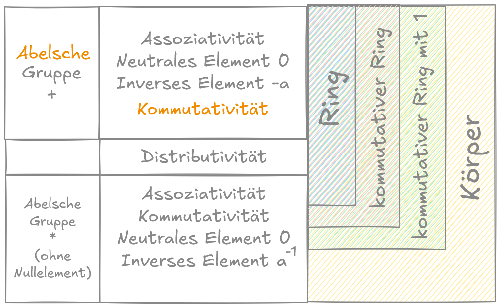

# 3. Algebraische Strukturen: Gruppen, Ringe, Körper

## Definition: Verknüpfung

Unter einer **Verknüpfung** auf einer Menge $G$ verstehen wir eine Abbildung:

$\circ: G \times G \to G$  
$(a, b) \mapsto a \circ b$

## Definition: Gruppe

Eine Menge $G$ zusammen mit einer Verknpüpfung $\circ$ heißt **Gruppe**, wenn folgende Axiome erfüllt worden sind:

*(G1)* **Assoziativität:** $(a \circ b) \circ c = a \circ (b \circ c)$, für alle $a, b, c \in G$
*(G2)* Es gibt ein **neutrales Element** $e \in G$ mit $e \circ a = a$ für alel $a \in G$
*(G3)* Es gibt zu jedem $a \in G$ ein **inverses Element** $a^{-1} \in G$ mit $a^{-1} \circ a = a$.

Wir schreiben:

$(G, \circ)$ wobei $G$ die Menge und $\circ$ die Verknüpfung ist.

### Satz

Sei $(G, \circ)$ eine Gruppe.
Dann ist das neutrale Element eindeutig bestimmt und für jedes $a$ ist $a^{-1}$ eindeutig bestimmt.  
Ferne gilt:  
$a \circ e = a$ für alle $a \in G$  
$a \circ a^{-1} = a$ für alle $a \in G$  

#### Beweis

**Zunächst die letzte Behauptung:**

Zu $a^{-1} \in G$ gibt es ein inverses Element $\bar{a} \in G$  
(*) mit $\bar{a} \circ a^{-1} = e$, woraus folgt  

```math

\begin{align}
a \circ a^{-1} &\overset{(G2)} = (e \circ a) \circ a^{-1} \\
&\overset{(G1)}= e \circ (a \circ a^{-1}) \\
&\overset{(*)}= (\bar{a} \circ a^{-1}) \circ (a \circ a^{-1}) \\
&\overset{(G1)}= \bar{a} \circ \underbrace{(a^{-1} \circ a)}_{\overset{(G3)}= e} \circ a^{-1} \\
&\overset{(G2)}= \bar{a} \circ a^{-1} \\
&\overset{(*)}= e
\end{align}
```

Dann erhalten wir den 2. Teil
$a \circ e \overset{(G3)}= a \circ (a^{-1} \circ a) \overset{(G1)}= (a \circ a^{-1}) \circ a = \overset{(G2)}= a$

**Eindeutigkeit des inversen Elements**

Seien $a'$ und $a^{-1}$ beides inverse zu $e$.  
Dann gilt:

$a' = a' \circ e = a' \circ (a \circ a^{-1}) \overset{(G1)} = (a' \circ a) \circ a^{-1} \overset{(G3)} = e \circ a^{-1} \overset{(G2)}= a^{-1}$


**Eindeutigkeit des neutralen Elements**

Sei $\tilde{e}$ ein weiteres neutrales Element, dann muss gelten:  
$\tilde{e} = e \circ \tilde{e} \overset{(Komm.)}= \tilde{e} \circ e \overset{(G2)} = e $


### Definition: Kommutative (bzw. Abelsche) Gruppe

Eine Gruppe $(G,\circ)$ heitß kommutativ (bzw. abelsch), wenn $a \circ b = b \circ a$für alle $a,b \in G$ gilt.

**Beispiel**

$(\mathbb{R},+)$ ist eine abelsche Gruppe
$(\mathbb{N}_0,+)$ ist **keine** Gruppe, da es kein inverses Element gibt ((G3) nicht erfüllt).

#### Notation

Sei $(G, +)$ eine abelsche Gruppe.  
Für $a_1,...,a_n \in G$ definieren wir:

$\displaystyle \sum_{i=1}^{n} a_i := a_1 + a_2 + ... + a_n = \sum_{i \in \set{1,..,n}} a_i$

## Definition: Ring

Ein Ring $(R,+,\cdot)$ ist eine Menge $R$ mit den zwei Verknüpfungen Addition ($+$) und Multiplikation ($\cdot$), für die die folgenden Axiome gelten:

*(R1)* $(R,+)$ ist eine abelsche Gruppe. Das neutrale Element wir mit $0$ bezeichnet.  
*(R2)* $(a \cdot b) \cdot c = a \cdot (b \cdot c)$ für alle $a,b,c \in R$ (Multiplikation ist Assoziativ)  
*(R3)* Es gelten dei Distributivgesetze. Das heißt für alle $a,b,c \in R$ gilt:  
$a \cdot (b + c) = a \cdot b + a \cdot c$  
$(a + b) \cdot c = a \cdot c + b \cdot c$  


Falls $R$ kommutativ bzgl. Multiplikation ist, heißt $(R, +, \cdot)$ kommutativer Ring.  
Ein Element $1 \in R$ heißt Einselement, wenn $1 \cdot a = a \cdot 1 = a$ für alle $a \in R$ gilt.  
Ein kommutativer Ring mit Einselement heißt **kommutativer Ring mit Eins**.

Zu $a \in R$ wird das inverse Element bzgl. der Addition mit $-a$ bezeichnet.


### Lemma

Sei $(R, +, \cdot)$ ein Ring mit Nullelement $0$.  
Dann gilt $a \cdot 0 = 0$ für alle $a \in R$


### Beweis

Es gilt $a \cdot 0 \overset{(R1)}= a \cdot (0+0) \overset{(R3)} = a \cdot 0 + a \cdot 0$  
Addition von $-a \cdot 0$ auf beiden Seiten:

```math
\begin{aligned}
a \cdot 0 + (-a \cdot 0) &= a \cdot 0 + a \cdot 0 + (-a \cdot 0) \\
\overset{\text{(R3) und (R1)}} \Leftrightarrow (a + (-a)) \cdot 0 &= a \cdot \underbrace{0 + (a + (-a)) \cdot 0}_{= â} \\
\Leftrightarrow â &= \underbrace{a \cdot 0}_{=e} + â
\end{aligned}
```

Aus der letzten Zeile folgt durch (R1): Wenn ein Element mit dem neutralen Element addiert wird, erhalten wir das Element. Demnach ist $a \cdot 0$ ein neutrales Element und somit $0$.

**Bemerkung:**

Wir können auch feststellen, dass in einem **kommutativen Ring** mit Einselement 1 tatsächlich $(-1) \cdot a$ das inverse Element zu $a$ bezüglich der Addition ist.  
Es gilt also:

```math
\begin{aligned}
(-1) \cdot a &= -a = a \cdot (-1) \\
\text{denn:} \quad a + (-1) \cdot a &= (1 + (-1)) \cdot a
 = 0 \cdot a = 0
\end{aligned}
```

### Satz
$(R,+,\cdot)$ Ring mit Einselement $1$ und Nullelement $0$ und $R$ enthalte mehr als ein Element. Dann gilt $1 \not = 0$.

### Beweis
Wir beweisen durch Widerspruch:  
Es sei also $1 = 0$  
Dann folgt:

```math
\begin{aligned}
a \cdot 1 &= a \cdot 0 \quad \forall a \in R \\
\Rightarrow a & = 0 \quad \forall a \in R \\
\Rightarrow R &= \set{0} \\
\end{aligned} \\
\text{Widerspruch zu "R enthalte mehr als ein Element"}
```

## Definition: Körper

Ein kommutativer Ring $(R,+,\cdot)$ mit Einselement heißt Körper, wenn es zu jedem $r \in R \setminus \set{0}$ ein inverses Element $r^{-1}$ bezüglich der Multiplikation gibt. ($r^{-1} \cdot r = 1)$  
Ferner bezeichnen wir das zu $r$ inverse Element bezüglich der Multiplikation mit $\frac{1}{r} := r^{-1}$.

**Bemerkung:**

Warum fordern wir nicht für $0$ die Existenz eines multiplikativen inversen Elements?  
Falls $\frac{1}{0}$ existieren würde, müsste es invers zu $0$ sein. Es müsste also $\frac{1}{0} \cdot 0 = 1$ gelten.  
Da aber für alle Körperelement $r$ die Gleichung $r \cdot 0 = 0$ gilt, kann es kein Körperelement geben, das invers zu $0$ ist.

### Satz
Jeder Körper $(K,+,\cdot)$ ist **nullteilerfrei**, das heißt $a \cdot b = 0 \Rightarrow (a=0) \lor (b=0) \quad \forall a,b \in K$

### Beweis
$a \cdot b = 0$ und ohne Beschärnkung der Allgemeinheit (o. B. d. A.) sei $b \not= 0$.
Wir multiplizieren beide Seiten von rechts mit $\frac{1}{b}$, was nach Annahme existiert (da $b \not = 0$) und erhalten:
```math
\begin{aligned}
a \cdot \underbrace{b \cdot \frac{1}{b}}_{= 1} &= \underbrace{0 \cdot \frac{1}{b}}_{=0} \\
\underbrace{a \cdot 1}_{= a} &= 0 \\
a &= 0 \\
\end{aligned}
```



### Beispiel: Komplexe Zahlen

$\mathbb{C} = \set{a + ib: a,b \in \R}$, wobei $i = \sqrt{-1}$, die imaginäre Einheit ist.

Operation:

$+$: $z_1 + z_2 = (a_1 +ib_1) + (a_2 + ib_2) = \overbrace{(a_1 + a_2)}^{a} + i\cdot \overbrace{(b_1 + b_2)}^{b}$  
$\cdot$: $z_1 \cdot z_2 = (a_1 +ib_1) \cdot (a_2 + ib_2) = \underbrace{(a_1 a_2 - b_1 b_2)}_{a} + i\cdot \underbrace{(a_1 b_2 + b_1 a_2)}_{b}$  

> Hinweis:
> Das erklärte "+" und "$\cdot$" bezieht sich auf die Verknüpfungen aus $(\mathbb{C}, +, \cdot)$. Das "+" und "\cdot" im rechten Teil, bezieht sich auf die bekannten Operation für den Körper der reellen Zahlen mit dem bekannten Addieren und Multiplizieren.

Für $z  = a + ib$ heißt $a$ Realteil und $b$ Imaginärteil von $z$.

| Element | Schreibweise | Schreibweise für $\mathbb{C} = \set{\R \times \R}$ |
| - | - | - |
| Nullelemet | $0 = 0 + i0$ | $(\underbrace{0}_{\text{Realteil}}, \overbrace{0}^{\text{Imaginärteil}})$ |
| Einselement | $1 = 1 + i0$ | $(1,0)$ |
| imaginäre Einheit | $i = 0 +i1$ | $(0,1)$ |

#### $(\mathbb{C}, +, \cdot)$ Körper

**1) $(\mathbb{C}, +)$ Abelsche Gruppe**

* Nullelement $0 + i0$ oder $(0, 0)$
* inverse Element
* Assoziativität
* Kommutativität

**2) $(\mathbb{C} \setminus \set{0}, \cdot)$ Abelsche Gruppe**

* Einselement $1 + i0$ oder $(1, 0)$
* inverse Element
* Assoziativität
* Kommutativität

**3) Distributivität**

**4) inverse Element zu " $\cdot$ "**


#### Extras

**Polarkoordinatendarstellung**

$z = re^{i\varphi} = r(\cos \varphi + i \sin \varphi) = \underbrace{r \cos \varphi}_{a} + \underbrace{i \sin \varphi}_{b}$  
$\mathbb{C} = \set{ z = re^{i\varphi}, \begin{array}{l} r \in \mathbb{R}^+_0 \\ \varphi \in \left[0, 2 \pi \right] \end{array}}$

Konjugiert komplexe Zahl zu $z = a +ib: \bar z = a - ib$  
Inverses Element bzgl. der Multiplikation, $z \not= 0, z \in \mathbb{C}$

$\frac{1}{z} = \frac{1}{a+ib}   \left(\cdot \frac{a-ib}{a-ib}\right) = \frac{\bar z}{z \cdot \bar z } = \frac{a-ib}{a^2+ib^2} = \underbrace{\frac{a}{a^2+b^2}}_{\text{Realteil}} - i \underbrace{\frac{b}{a^2 + b^2}}_{\text{Imaginärteil}} \in \mathbb{C}$


### Weitere Beispiele

1) $(\mathbb{Q}, +, *)$ ist ein Körper
2)  $(\mathbb{R}, +, *)$ ist ein Körper
3)  $(\set{0,1}, +, *)$ ist ein Körper, genannt $\mathbb{F}_2$
    * Addition entspricht der Rechnung "modulo 2"

Mit der Addition:

|**+**|**1**|**0**|
|-|-|-|
|**1**|0|1|
|**0**|1|0|


und der Multiplikation:


|**$\cdot$**|**1**|**0**|
|-|-|-|
|**1**|1|0|
|**0**|0|0|

> Bemerkung: Der Restklassenring $\mathbb{F}_p$ ist ein Körper, wenn $p$ eine Primzahl ist.

**Weiteres Beispiel**

4) $V = \set{v = a + \sqrt{2}b | a,b \in \mathbb{Q}}$

$+$: $v_1 + v_2 = (a_1 + a_2) + \sqrt{2}(b_1+b_2)$  
$\cdot$: $v_1 \cdot v_2 = (a_1 \cdot a_2 + 2b_1 \cdot b_2) + \sqrt{2}(a_1 b_2+a_2 b_1)$

$(V, +, \cdot)$ Körper oder **nur** ein Ring?

Inverses bzgl. Multiplikation:  
$\frac{1}{v} = \frac{1}{a+\sqrt{2}b} = \frac{a-\sqrt{2}b}{a^2-2b^2} = \underbrace{\frac{a}{a^2-2b^2}}_{\in \mathbb{Q}} + \sqrt{2} \underbrace{(\frac{-b}{a^2}-2b^2)}_{\in \mathbb{Q}}$  
$v \not= 0$  
$a^2-2b^2 \not= 0$, da $\sqrt{2} \notin \mathbb{Q}$

$\Rightarrow \frac{1}{v} \in V \Rightarrow (V, +, \cdot)$ ist ein Körper.