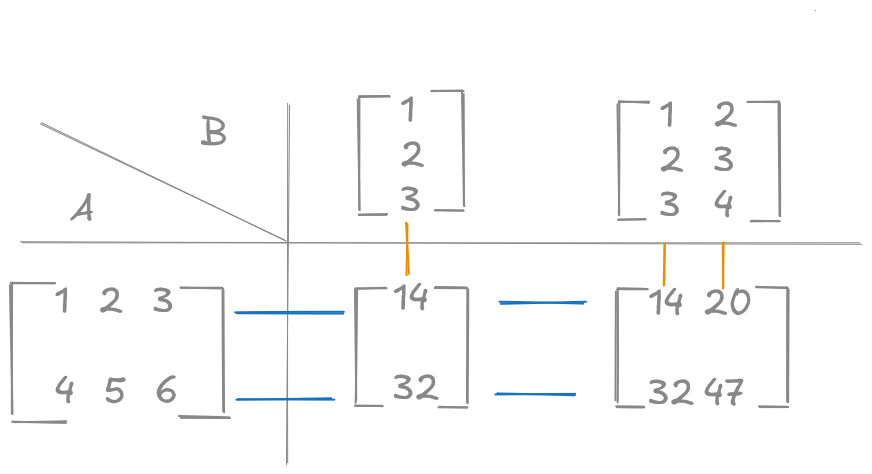
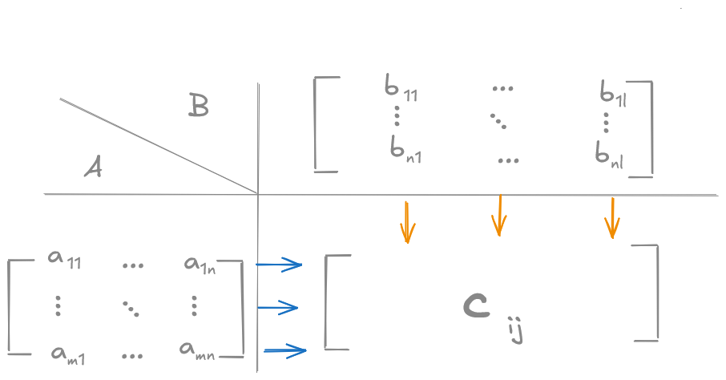

# 4. Der Ring der Matrizen

### Definition

Sei $(K, + ,\cdot)$ ein Körper, $m,n \in \mathbb{N}_0$.

Ein Feld $A = [a_{ij}] = \left[ \begin{matrix} a_{11} &  a_{12} & \dots &  a_{1n}\\  a_{21} &  a{_{22}} & \dots & a_{2n} \\ \vdots & \ddots & & \vdots \\ a_{m1} &a_{m2} & \dots & a_{mn} \end{matrix} \right]$  
mit $a_{ij} \in K$ für alle $i$ von $1, \dots, n$ und $j$ von $1, \dots, n$ heißt **(m $\times$ n)-Matrix mit Koeffizienten in $K$** oder **(m $\times$ n)-Matrix über $K$**.

### Bezeichnungen

a) $K^{m \times n}$ (oft auch $K^{m,n}$) ist die Menge aller (m $\times$ n)-Matrizen über K.  
b) $\underset{j \text{= Spalte}}{\overset{i = \text{Zeile}}{a_{ij}}}$ ist der (i,j)-te Koeffizient oder Eintrag (manchmal $[A]_{ij} = a _{ij}$)  
c) $[a_{i1}, \dots, a_{in}]$ i-te Zeile von A ((1 $\times$ n)-Matrix)  
d) $\left[ \begin{matrix} a_{1j} \\ \vdots \\ a_{mj} \end{matrix} \right]$ j-te Spalte von A ((m $\times$ 1)-Matrix)  
e) 0 Nullmatrix, das heißt alle Einträge sind 0.  
f) $I_n$ Einheitsmatrix in $K^{n\times n}$ (muss quadratisch sein), das heißt die Matrix hat die EInträge $\delta_{ij} = \begin{cases} \text{1 i = j} \\ \text{0 sonst} \end{cases}$  


## 4.1 Matrixoperationen und algebraische Strukturen

### 4.1.1 Addition

$+$: $K^{m \times n} \times K^{m \times n} \to K^{m \times n }$  
$c_{ij} = a_{ij} + b_{ij}$ für alle $i=1, \dots, m; j = 1, \dots, n$

#### Beispiel
$A = \left[ \begin{matrix}1  &  2 \\ 3 & 4 \end{matrix} \right]; B = \left[ \begin{matrix}6  &  7 \\ 8 & 9 \end{matrix} \right]$


$C = A + B = \left[ \begin{matrix}1+6  &  2+7 \\ 3+8 & 4+9 \end{matrix} \right] = \left[ \begin{matrix}7  & 9 \\ 11 & 13 \end{matrix} \right]$

#### Lemma

$(K^{m \times n }, +)$ ist mit dem additiv inversen Element $-A := [-a_{ij}]$ für $A \in K^{m \times n }$ eine kommutative Gruppe.  
Das neutrale Element ist die Nullmatirx $0 \in K^{m \times n}$

### 4.1.2 Skalarmultiplikation

$\cdot$: $K \times  K^{m \times n} \to K^{m \times n}$  
$(r, A) \mapsto r \cdot A = [r \cdot a_{ij}]_{ij}$

Elemente des Grundkörpers nennt man **Skalare**.

#### Lemma

Sei $A, B \in K^{m \times n}; r,s \in K $  
Dann gilt  
a) $(r \cdot s) \cdot A  = r \cdot (s \cdot A)$  
b) $(r+s) \cdot A = rA + sA$  
c) $r \cdot (A + B)  = rA + rB$  
d) $1 \cdot A  = A$  
e) $A + \underbrace{(-A)}_{(-1) \cdot A}  = 0$

#### Beweis

Folgerung aus komponentenweisen Betrachtung.

#### Beispiel

$r=3, A= \left[ \begin{matrix} 1 & 2 & 3 \\ 4 & 5 & 6 \end{matrix} \right]$ ($A \in \mathbb{R}^{2 \times 3}$)  
$(K, +, \cdot) = (\mathbb{R}, +, \cdot)$  
$(r \cdot A) = \left[ \begin{matrix} 3 \cdot 1 & 3 \cdot 2 & 3 \cdot 3 \\ 3 \cdot 4 & 3 \cdot 5 & 3 \cdot 6 \end{matrix} \right] = \left[ \begin{matrix} 3 & 6 & 9 \\ 12 & 15 & 18 \end{matrix} \right]$


### 4.1.3 Matrixmultiplikation

Defintion der Multiplikation von Matrizen soll eine einfache Formulierung und Lösung linearer Gleichungssysteme erlauben.

```math
\begin{aligned}
& a_{11} x_1 + \dots & + a_{1n} x_n & = r_1 \\
& a_{21} x_1 + \dots & + a_{2n} x_n & = r_2 \\
& \quad \quad \vdots \\
& a_{m1} x_m + \dots & + a_{mn} x_n & = r_m \\
\end{aligned} \\
\quad \\
\big\downarrow  \\
\quad \\

\left[
    \begin{matrix}
    a_{11} & \dots & a_{1n} \\
    a_{21} & \dots & a_{2n} \\
    \vdots & \ddots & \vdots \\
    a_{m1} & \dots & a_{mn} \\
    \end{matrix}
\right]

\cdot

\left[
    \begin{matrix}
    x_1 \\
    x_2 \\
    \vdots \\
    x_n
    \end{matrix}
\right]

= 

\left[
    \begin{matrix}
    r_1 \\
    r_2 \\
    \vdots \\
    r_m
    \end{matrix}
\right]
```

> **Wunsch:** 
> Matrix-Vektor-Form des linearen Gleichungssystem

Eine Matrix kann als Ansammlung ihrer Spalten betrachetet werden.

$B = [b_1, b_2, \dots, b_l], b_j = \left[ \begin{matrix} b_{1j} \\ b_{2j} \\ \vdots\\  b_{kj} \end{matrix}\right] \in K^{k \times 1}; j = 1, \dots, l$

$B \in K^{k \times l}$


```math

A \cdot B =
\left[
    \begin{matrix}
    \sum\limits_{i=1}^k a_{1i}b_{i1} & \sum\limits_{i=1}^k a_{1i}b_{i2} & \dots & \sum\limits_{i=1}^k a_{1i}b_{il} \\
    \vdots \\
    \sum\limits_{i=1}^k a_{mi}b_{i1} & \sum\limits_{i=1}^k a_{mi}b_{i2} & \dots & \sum\limits_{i=1}^k a_{mi}b_{il} 
    \end{matrix}
\right]
```

Es gilt:

$C = A \cdot B$

$\cdot$: $K^{\textcolor{green}{m} \times \textcolor{red}{n}} \times K^{\textcolor{red}{n} \times \textcolor{green}{l}} \to K^{\textcolor{green}{m} \times \textcolor{green}{l}} $

> Zwei Matrizen können nur dann miteinander multipliziert werden, wenn die Anzahl der Spalten der ersten matrix mit der Anzahl der Zeilen der zweiten Matrix übereinstimmt.

#### Beispiel

$A =  \left[ \begin{matrix} 1 & 2 & 3 \\ 4 & 5 & 6 \end{matrix} \right], A \in K^{\textcolor{green}2 \times \textcolor{red}3}$


$B =  \left[ \begin{matrix} 1 \\ 2 \\ 3 \end{matrix} \right], A \in K^{\textcolor{red}3 \times \textcolor{green}1}$

$C = A \cdot B, C \in K^{\textcolor{green}2 \times \textcolor{green}1}$

**Schema:**

<br>  





#### Lemma

$A, \tilde A \in K^{m \times n}; B, \tilde B \in K^{n \times l}; C \in K^{l \times p}; r \in K$, dann gilt:

a) Assoziativität $(A \cdot B) \cdot C = A \cdot (B \cdot C)$  
b) Distributivität $(A + \tilde A) \cdot B = A \cdot B + \tilde A \cdot B$  
c) Distributivität $A \cdot (B + \tilde B) = A \cdot B + A \cdot \tilde B$  
d) links- und rechtsneutrales Element $I_m \cdot A = A \cdot I_n = A$
e) $(r \cdot A) \cdot B = r \cdot (A \cdot B) = A \cdot (r \cdot B)$  
f) Nullelement
```math
\begin{aligned}
0_m \cdot A = \quad & 0_{m,n} \\
 & \parallel \\
A \cdot 0_n = \quad & 0_{m,n} \\
\end{aligned}
```

> Hinweis: Eine Matrixmultiplikation kommutiert in der Regel nicht!

#### Beweis

a)

$[ \underbrace{(A \cdot B)}_{\tilde A} \cdot C]_{ij} = \sum\limits_{r=1}^l (\underbrace{\sum\limits_{k=1}^n a_{ik} \cdot b_{kr}}_{\tilde A_{ir}}) \cdot c_{rj} = \sum\limits_{k=1}^n a_{ik} (\sum\limits_{r=1}^l b_{kr} \cdot c_{rj}) = [A \cdot (B \cdot C)]_{ij}$

b-f) Komponentenweise verfahren

**Bemerkung:** Die Kommutativität gilt bei Matrizen im Allgemeinen **nicht**!


**Gegenbeispiel (Kommutativität):**

$A = \left[ \begin{matrix} 1 & 1 \\ 2 & 2 \end{matrix} \right], B = \left[ \begin{matrix} 0 & 0 \\ 1 & 0 \end{matrix} \right]$

$A \cdot B = \left[ \begin{matrix} 1 & 0 \\ 2 & 0 \end{matrix} \right]$

$B \cdot C = \left[ \begin{matrix} 0 & 0 \\ 1 & 1 \end{matrix} \right]$

$A \cdot B \not = B \cdot A$

**Bemerkung:** Matrixprodukt ist **nicht** nullteilerfrei!

**Beispiel:**

$A = \left[ \begin{matrix} 1 & 1 \\ 2 & 2 \end{matrix} \right] \cdot \left[ \begin{matrix} 1 & -1 \\ -1 & 1 \end{matrix} \right] = \left[ \begin{matrix} 0 & 0 \\ 0 & 0 \end{matrix} \right]$

Asu $A \cdot B$ folgt **nciht** notwendigerweise $A = 0$ oder $B = 0$.

#### Definition (Invertierbare Matrix)

Eine Matrix heißt **invertierbar** $(A \in K^{n \times n})$ wenn es ein $\tilde A \in  K^{n \times n}$ gibt mit $\tilde A \cdot A = I_n$. Man schreibt dann $\tilde A =: A^{-1}$ und nennt $A^{-1}$ die zu $A$ inverse Matrix.  
Die Menge dedr invertierbaren Matrizen wird mit $GL_n(K)$ (GL = general linear) bezeichnet.


#### Lemma
Für $A, B \in GL_n(K)$ gilt $(A \cdot B)^{-1} = B^{-1} \cdot A^{-1}$. Damit ist GL_n(K) bezüglich der Matrixmultiplikation eine (**nicht-kommutative**) Gruppe und für die Inverse einer Matrix $A$ gilt, $A \cdot A^{-1} = I_n$.

#### Beweis
$(B^{-1} \cdot A^{-1}) \cdot (A \cdot B) = B^{-1} \cdot \underbrace{(A^{-1} \cdot A)}_{= I_n} \cdot B = B^{-1} \cdot B = I_n$

Damit is auch die Abgeschlossenheit des Matrixprodukts in GL_n(K) bewiesen. Die Gültigkeit der restlichen Gruppenaxiome folgt aus dem Lemma (zu den Matrixprodukteigenschaften).  
Insbesondere folgt die Eindeutigkeit der inversen Matrix und die Kommutativität bezüglich der inversen Matrix aus Kaptiel 3 (1. Satz).

**Beispiel:**

$A = \left[\begin{matrix}a & b \\ c & d\end{matrix}\right]$
$\Rightarrow A^{-1} = \frac{1}{ad-bc} \left[\begin{matrix}d & -b \\ -c & a\end{matrix}\right]$

$A^{-1} \cdot A = \left[\begin{matrix}1 & 0 \\ 0 & 1 \end{matrix}\right]$

| $e = \frac{1}{ad-bc}$ | $\left[\begin{matrix}a & b \\ c & d\end{matrix}\right]$ |
| - | - |
| $e \cdot \left[\begin{matrix}d & -b \\ -c & a\end{matrix}\right]$ | $\begin{matrix} e\underbrace{(da-bc)}_{=e^{-1}} & e\underbrace{(db-bd)}_{=0} \\ e\underbrace{(-ca+ac)}_{=0} & e\underbrace{(-cb+ad)}_{=e^{-1}}\end{matrix}$ |
| | $\left[\begin{matrix}1 & 0 \\ 0 & 1\end{matrix}\right]$ |

Eine (2x2)-matrix ist also genau dann invertierbar, wenn $a \cdot b - b \cdot c \not= 0$ ist.

$A_1 = \left[\begin{matrix}1 & 10 \\ -10 & 0 \end{matrix}\right]$ ist invertiertbar.


$A_2 = \left[\begin{matrix}1 & 0 \\ -10 & 0 \end{matrix}\right]$ ist nicht invertiertbar.


$A_3 = \left[\begin{matrix}1 & 2 \\ 1 & 2 \end{matrix}\right]$ ist nicht invertiertbar.

### 4.1.4 Matrixtransposition

#### Definition

Sei $A \in K^{m \times n}$. Dann heißt $B \in K^{m \times n}$ mit der Vorschrift $b_{ij} = a_{ji}$ für alle $j = 1, \dots, n; i = 1, \dots, m$ die **transponierte** Matrix zu $A$ (Abk. $B =: A^T$)

**Beispiel:**

$A = \left[\begin{matrix}1 & 2 \\ 3 & 4 \\ 5 & 6\end{matrix}\right] \in \mathbb{R}^{3 \times 2}$

$A^T = \left[\begin{matrix}1 & 3 & 5 \\ 2 & 4 & 6\end{matrix}\right] \in \mathbb{R}^{2 \times 3}$

Falls $K = \mathbb{C}$ definieren wir die konjugiert transponierte oder auch hermitisch transponierte Matrix $A^H := \bar A^T = \left[ \bar a_{ji}\right]_{ij}$.  
Wobei die Konjugierte einer komplexen Zahl $Z = a+ib$ definiert ist durch $\bar Z = a -ib$.

**Beispiel:**

$A = \left[\begin{matrix}1 & 1-i & 3\\ 2+3i & i^2 & 5i\end{matrix}\right] = \left[\begin{matrix}1 & 1-i & 3\\ 2+3i & -1 & 5i\end{matrix}\right]$ ($i^2 = -1$)

$A^H = \left[\begin{matrix}1 & 2-3i \\ 1+i & -1 \\ 3 & -5i \end{matrix}\right]$

#### Lemma

Seien $A, \tilde A \in K^{m\times n}, B \in K^{n \times l}, r \in K$ dann gilt

1) $(A + \tilde A)^T = A^T + \tilde A^T$
2) $(r \cdot A)^T = r \cdot A^T$
3) $(A \cdot B)^T = B^T \cdot A^T$
4) $(A^T)^T = A$
5) Für $m = n$ und $A \in GL_n(K)$ gilt $(A^{-1})^T = (A^T)^{-1}$ (Daher schreiben wir auch $(A^{-1})^T = (A^T)^{-1} =: A^{-T}$)

Für $K = \mathbb{C}$ giltn diese Eigenschaften auch für die konjugiert transponierte ansteller der transponierten Matrix.

#### Beweis

1., 2., 4. einfaches Nachrechnen mit Definition.

Für 3. Sei $A \cdot B = C = [c_{ij}]_{ij}$ mit $c_{ij} = \sum\limits_{k=1}^n a_{ik} \cdot b_{kj}$  
sei $A^T = [a'_{ij}]_{ij}$, $B^T = [b'_{ij}]_{ij}$, $C^T = [c'_{ij}]_{ij}$.  
Dann gilt: $c'_{ij} = c_{ji} = \sum\limits_{k=1}^n a_{jk}b_{ki} = \sum\limits_{k=1}^na'_{kj}b'_{ik} = \sum\limits_{k=1}^n b'_{ik}a'_{kj} \Rightarrow C^T = B^T \cdot A^T$

Für 5. Es gilt $A^{-1} \cdot A = I_n$  
$\Rightarrow (A^{-1} \cdot A)^T = I_n^T = I_n$  
$\Rightarrow A^T \cdot (A^{-1})^T = I_n$  

Daraus folgt $(A^{-1})^T = (A^T)^{-1} wegen der Eindeutigkeit der Inversen in der Gruppe GL_n(K). Die Verallgemeinerung auf konugiert transponierte Matrix ist aufgrund der Rechenregeln für die komplexe Konjugation möglich.
Für alle $z_1, z_2 \in \mathbb{C}$ gilt

$\bar{z_1 + z_2} = \bar{z_1} + \bar{z_2}$, $\bar{z_1 \cdot z_2} = \bar{z_1} \cdot \bar{z_2}$

## 4.2 Spezielle Matrixklassen

#### Definition

Sei $A \in K^{n \times n}$

1) A heißt **symmetrisch**, falls $A = A^T$  
Für $K = \mathbb{C}$ heißt $A$ **hermitisch**, falls $A = A^H$

2) $A$ heißt obere Dreiecksmatrix, falls $a_{ij} = 0$ für alle $i > j$  
$A = \left[\begin{matrix}a_{11} & & * \\ 0 & \ddots  \\ \vdots & \ddots & \ddots \\  0 & \dots & 0 & a_{nn}\end{matrix}\right]$

3) $A$ heißt untere Dreiecksmatrix falls $a_{ij} = 0$ für alle $ i < j$ (bzw. falls $A^T$ eine obere Dreiecksmatrix ist).

4)  $A$ heißt Diagonalmatrix, falls $A$ obere und untere Drecksmatrix ist. ($a_{ij} = 0$ für aa $i \not = j$)

5) $A$ heißt Permutationsmatrix, falls in jeder Zeile und in jeder Spalte genau ein Eintrag 1 ist und alle anderen 0 sind.

**Beispiel:**

$P_1 = I_2 = \left[\begin{matrix}1 & 0 \\ 0 & 1 \end{matrix}\right], P_2 = \left[\begin{matrix}0 & 1 \\ 1 & 0 \end{matrix}\right].

$P_1 \cdot A = A$

$\underbrace{P_2 \cdot A}_{\text{von rechts multipliziert}} = \left[\begin{matrix}0 & 1 \\ 1 & 0 \end{matrix}\right] \left[\begin{matrix}a_{11} & a_{12} \\ a_{21} & a_{22} \end{matrix}\right] = \left[\begin{matrix}a_{21} & a_{22} \\ a_{11} & a_{12} \end{matrix}\right]$ (Zeilenpermutation)


$\underbrace{A \cdot P_2}_{\text{von link multipliziert}} = \left[\begin{matrix}a_{11} & a_{12} \\ a_{21} & a_{22} \end{matrix}\right] \left[\begin{matrix}0 & 1 \\ 1 & 0 \end{matrix}\right] = \left[\begin{matrix}a_{12} & a_{11} \\ a_{22} & a_{21} \end{matrix}\right]$ (Spaltenpermutation)


#### Lemma

a) Die Matrizen $K^{n \times n}$ bilden einen (**nicht-kommutativen**) Ring mit 1.  
b) Die Menge der invertierbaren Diagonalmatrizen bilden eine kommutative multiplikative Gruppe

> Achtung! Bezgüglich der Addition ist die Menge der invertierbaren Diagonalmatrizen **nicht** abgeschlossen (sonst wäre sie ein Körper).  
> Beispiel: $\left[\begin{matrix}1 & 0 \\ 0 & 2\end{matrix}\right] + \left[\begin{matrix}1 & 0 \\ 0 & -2\end{matrix}\right] = \left[\begin{matrix}2 & 0 \\ 0 & 0\end{matrix}\right]$  
> Das Ergebnis ist nicht invertierbar!

c) Die Menge der Permutationsmatrizen in $K^{n \times n}$ bidlet eine multiplikative Gruppe.

#### Beweis
a) *TODO (simples Nachrechnen)*  
b) *TODO (simples Nachrechnen)*  
c) Seien $A = [a_{ij}]_{ij}, B = [b_{ij}]_{ij} \in K^{n \times n}$ Permutationsmatrizen und sei $C = A \cdot B = [c_{ij}]_{ij}$ mit $[c_{ij}]_{ij} = \sum\limits_{k=1}^n a_{ik} b_{kj} = (a_{i1}, ..., a_{in}) \left(\begin{matrix}b1j \\ \vdots \\ b_{nj}\end{matrix}\right)$

In der i-ten Zeile von $A$ gibt es **genau ein** $a_{ik} = 1$. Dazu passend gibt es **genau eine** Spalte in $B$, in der $b_{kj} = 1$, somti gibt es in jeder Zeile von $C$ genau einen 1-Eintrag. Alle anderen Einträge sind 0. Analoges gilt für jede Spalte von $C$.

Für $C = A \dot A^T$ gilt $(A^T = [a'_{ij}]_{ij})$
$c_{ij} = \sum\limits_{k=1}^n a_{ik} \underbrace{a'_{kj}}_{=a_{jk} = \begin{cases} \text{1 } i = j \\ \text{0 } i \not = j \end{cases}} = \delta_{ij}$

($A^{-1} = A^T$)

#### Lemma

Die Menge der invertierbaren oberen Dreiecksmatrizen in $K^{n \times n}$ ist eine (**nicht-kommutative**) multiplikative Gruppe. (Analoges gilt für untere Dreiecksmatrizen.)

#### Beweis

Seien $A = [a_{ij}]_{ij}$ und $B = [b_{ij}]_{ij}$ invertierbare obere Dreiecksmatrizen in $K^{n \times n}$.
Sei $C = A \cdot B = [c_{ij}]_{ij}$.

Für $i > j$ gilt:

$c_{ij} = \sum\limits_{k=1}^n a_{ik} b_{kj} = \sum\limits_{k=1}^j a_{ik} b_{kj} + = \sum\limits_{k=j+1}^n a_{ik} b_{kj} = 0$

$k \leq j \leq i \Rightarrow a_{ik} = 0$ und $k > j \Rightarrow b_{kj} = 0$

Da A und B als invertierbar vorausgesetzt sind, ist das Produkt $ C = AB$ nicht nur eine obere Dreiecksmatrix, sondern auch invertierbar.  
Assoziativität $\checkmark$, Existenz der 1 ($I$) $\checkmark$.  
Es bleibt zu zeigen, dass $A^{-1}$ eine obere Dreiecksmatrix ist. Die Existenz ist nach Voraussetzung gegeben.  
Wir suchen $C = [c_{ij}]_{ij}$, sodass $A \cdot C = I$

Das bedeutet:

$\left[\begin{matrix} a_{11} & \dots & \dots & a_{1n} \\  & a_{22} & \dots & \vdots \\ & & \ddots & \vdots  \\ 0 & & &  a_{mn}\end{matrix}\right] \left[\begin{matrix} & | \\ & | \\ & | \\ & | & & & \end{matrix}\right] = \left[\begin{matrix} 1 & 0 & \dots & 0 \\ 0 & 1 & \dots & \vdots \\ \vdots & \vdots  & \diagdown & \vdots  \\ 0 & 0 & \dots & 1\end{matrix}\right]$

Für jede Spalte von C gilt:

$\left[\begin{matrix} a_{11}  & \dots & a_{1n} \\ & \ddots & \vdots  \\ 0 & &  a_{mn}\end{matrix}\right] \underset{\text{j-te Spalte von }C}{\left[\begin{matrix} c_{ij} \\ \vdots \\ c_{nj} \end{matrix}\right]} = \underset{\text{j-te Spalte von }I}{\left[\begin{matrix}  0 \\ \vdots \\ \underset{\text{j-te Zeile}}{1} \\ \vdots \\ 0\end{matrix}\right]}$

$\delta_{ij} = \begin{cases} 1 \quad i = j \\ 0 \quad \text{sonst} \end{cases}$

$a_{nn} \cdot c_{nj} = \delta_{nj} \Rightarrow c_{nj} = \frac{\delta_{nj}}{a_{nn}}$


$a_{n-1,n-1} \cdot c_{n-1,j} + a_{n-1,n} \cdot \underbrace{c_{nj}}_{= \frac{\delta_{nj}}{a_{nn}}} = \delta_{n-1,j}$  
$\Rightarrow c_{n-1,j} = \frac{1}{a_{n-1,n-1}}(\delta_{n-1,j} - a_{n-1,n}) \underbrace{c_{nj}}_{= \frac{\delta_{nj}}{a_{nn}}}$

... und so weiter


Insgesamt ergibt sich daraus dei Formel für die Inverse (durch sogenanntes Rückwärtseinsetzen):  
Für $j=1,\dots,n$ gilt:

$c_{nj} = \frac{\delta_{nj}}{a_{nn}}$

$\color{red}c_{ij} = \frac{1}{a_{nn}}(\delta_{ij} - \sum\limits_{k=i+1}^n a_{ik} c_{kj}) \color{text}\quad \text{mit } i = n-1, \dots, 1$

Aus der Existenz von $A^{-1}$ folgt außerdem $a_{ii} \not = 0$ für alle $i$.

Nun müssen wir zeigen, dass $C$ eine obere Dreiecksmatrix ist ($c_{sj} = 0$ für $s > j, j < n$).

**Induktionsanfang**  
Sei $s=n$. Dann gilt $c_{sj} = c_{nj} = \frac{\delta_{nj}}{a_{nn}} \overset{j < n}= 0.$

**Induktionsvoraussetzung**  
Es seien $c_{nj} = \dots = c_{sj} = 0$ mit $s > j + 1$

**Induktionsschritt**  
 Wir betrachten $c_{s-1,j}$ und erhalten:  

$c_{s-1,j} = \frac{1}{a_{s-1,s-1}}(\underbrace{\delta_{s-1,j}}_{= 0\text{ , da } s-1 \not = j} - \sum\limits_{k=s}^n a_{s-1,k} \underbrace{c_{kj}}_{= 0 \text{ nach IV}})$


**Beispiel**

a) $A = \left[\begin{matrix}1 & 2 & 0 \\ 0 & 1 & 2 \\ 0 & 0 & 1\end{matrix}\right]$

$n = 3$  
$c_{31} = 0$  
$c_{21} = 0$  
$c_{11} = \frac{1}{a_{11}}(\delta_{11} - a_{12}c_{21} - a_{13}c_{31}) = \frac{1}{1}(1 - 0 - 0) = 1$


$c_{32} = 0$  
$c_{22} = \frac{1}{a_{22}}(\delta_{22} - a_{23}c_{32}) = \frac{1}{1}(1 - 0) = 1$  
$c_{12} = \frac{1}{a_{11}}(\delta_{12} - a_{12}c_{22} - a_{13}c{32}) = \frac{1}{1}(0 - 2 - 0) = -2$

$c_{33} = \frac{1}{a_{33}}(\delta_{33} - 0) = \frac{1}{1}(1 - 0) = 1$  
$c_{23} = \frac{1}{a_{22}}(\delta_{23} - a_{23}c_{33}) = \frac{1}{1}(0 - 2) = -2$  
$c_{13} = \frac{1}{a_{11}}(\delta_{13} - a_{12}c_{23} - a_{13}c{33}) = \frac{1}{1}(0 +4 - 0) = 4$

$\Rightarrow C = \left[\begin{matrix}1 & -2 & 4 \\ 0 & 1 & -2 \\ 0 & 0 & 1\end{matrix}\right]$

b) Für Blockmatrizen $A = \left[\begin{matrix}A_{11} & A_{12} \\ A_{21} & A_{22} \end{matrix}\right]$ in oberer Dreiecksform mit invertierbaren Matrizen $A_{11}, A_{22}$ ist die Inverse gegeben:

$A^{-1} = \left[\begin{matrix}A_{11}^{-1} & -A_{11}^{-1}\cdot A_{12} \cdot A_{22}^{-1} \\ 0 & A_{22}^{-1}\end{matrix}\right]$

**Beweis**

> Todo! Tipp: Siehe Übung am 12.05.2026