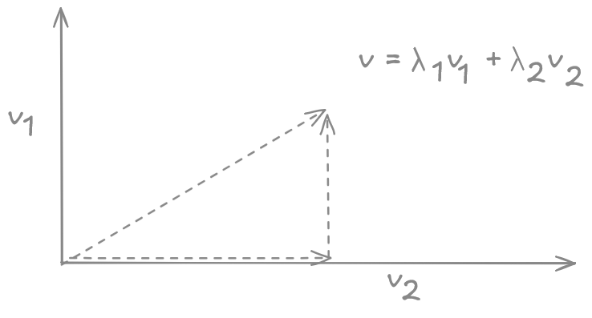

# 6. Vektorräume

### Definition:

Sei $K$ ein Körper. Eine Menge $V$ zusammen mit einer Abbild $+$ (Vektoraddition)

```math
\begin{aligned}
& + : & V \times V & \to V \\
& & (v,w) & \mapsto v+w
\end{aligned}
```

und eine Abbildung $\huge \cdot$ (Skalarmultiplikation)

```math
\begin{aligned}
& \cdot : & K \times V & \to V \\
& & (\lambda,v) & \mapsto \lambda \cdot v
\end{aligned}
```

heißt K-Vektorraum, wenn folgendes gilt:

**(VR1)**: $(V,+) ist eine Abelsche Gruppe. Das neutrale Element wird (vorläufig) mit 0 bezeichnet. Das inverse Element (zu $v \in V$) mit $-v$.

**(VR2)**: Die Skalarmultiplikation ist auf folgende Weise mit $(V,+)$ verträglich. Für $\lambda, \mu \in K$ und $v,w \in V$ gelte:  

a) $(\lambda + \mu) \cdot v = \lambda v + \mu v$  
b) $\lambda \cdot (v+w) = \lambda \dot v + \lambda \cdot w$  
c) $\lambda \cdot (\mu \cdot v) = (\lambda \cdot \mu) \cdot v$  
d) $1 \cdot v = v$  

Die Elemente von $V$ nennt man auch **Vektoren**.

**Beispiel:**

a) $K = \mathbb{R}, V = \mathbb{R}^3 = \mathbb{R} \times \mathbb{R} \times \mathbb{R}$  
b) $K = \mathbb{C}, V = \mathbb{C}^n$  
c) $K = \mathbb{R}, V =\mathbb{R}^{m \times n}$  
d) $K = \mathbb{R}, V = \mathcal C([-\pi, \pi], {R}) = \set{f: [- \pi, \pi] \to \mathbb{R}, f \text{ stetig}}$  
e) $K = \mathbb{R}, V=  \set{0}$  
f) $K = \mathbb{F}_2, V = \mathbb{F}_2^n$


### Lemma:

$V$ K-Vektorraum, $v \in V,\lambda \in K$  
Dann gilt

a) $\underbrace{0}_{\in K} \cdot v = \underbrace{\vec 0}_{\in V} \quad \quad 0 \cdot \left(\begin{matrix}v_1 \\ v_2 \\ v_3 \end{matrix} \right) = \left(\begin{matrix}0 \\ 0 \\ 0 \end{matrix} \right) $

b) $\lambda \cdot \vec 0 = \vec 0$  
c) $\lambda \dot v = \vec 0$ impliziert $\lambda = 0$ oder $v = \vec 0$
d) $(-\lambda) \cdot v = \lambda \cdot (-v)$

### Beweis

a) Es gilt: $0 \cdot v = (0 + 0) \cdot v = 0 \cdot v + 0 \cdot v$  
Addition mit Inversen führt auf Behauptung

b) $\lambda \cdot \vec 0 = \lambda \cdot (\vec 0 + \vec 0) = \lambda \cdot \vec 0 + \lambda \cdot \vec 0$  
Addition mit Inversen führt auf Behauptung

c)  Ist $\lambda \cdot v = \vec 0$ mit $\lambda \not = 0$, so gilt

$\lambda^{-1}(\lambda \cdot v) = \lambda^{-1} \cdot \vec 0 = \vec 0$  
$(\lambda^{-1} \cdot \lambda) \cdot v = \vec 0$

d) $\lambda \cdot v + (-\lambda) \cdot v = (\lambda + (-\lambda)) \cdot v = 0 \cdot v = \vec 0$  
$\lambda \cdot v + \lambda \cdot (-v) = \lambda(v + (-v)) = \lambda \cdot \vec 0 = \vec 0$

Mit Eindeutigkeit der inversen Elemente in Gruppen folgt die Behauptung.

**Bemerkung**:
Wegen der Eigenschaften in Lemma a) und b) wird im folgenden **nicht** mehr explizit zwischen $0$ und $\vec 0$ in der Notation unterschieden.

### Definition

$V$ K-Vektorraum, $U \subseteq V$ eine Teilmenge.  
$U$ heißt **Untervektorraum** (kurz **Unterraum**) von $V$ falls gilt:


**(UV1)**: $U \not = \set{}$  
**(UV2)**: Abgeschlossenheit bezüglich Vektoraddition: $u_1, u_2 \in U \Rightarrow u_1 + u_2 \in U$  
**(UV3)**: Abgeschlossenheit bezüglich Skalarmultiplikation: $u \in U, \lambda \in K \Rightarrow \lambda \cdot u \in U$

**Bemerkung**  
Damit ist $U$ für sich genommen ebenfalls ein Vektorraum.  
**Wichtig:**
- Der Unterraum muss die Null enthalten!
- Im $\mathbb{R}^3$ sind Geraden durch $0$ Unterräume!
- Krummlinige Kurven durch 0 können kein Unterraum sein!

**Beispiele:**

- $\mathbb{R}^3 \subseteq \mathbb{R}^4$
- $\underset{\text{stetig differenzierbare Funktionen}}{\mathcal C^1([-\pi,\pi],\mathbb{R})} \subseteq \underset{\text{stetige Funktionen}}{\mathcal C([-\pi,\pi],\mathbb{R})}$


## 6.2 Basis und Dimension

### Definition
$V$ K-Vektorraum, $v_1, ..., v_r \in V$

a) Dann heißt $\sum\limits_{i=1}^r \lambda_i v_i \in V$ mit $\lambda_i \in K$ eine **Linearkombination** der Vektoren $v_1, ..., v_r$  
b) $span(v_1,...,v_r) = \set{\sum\limits_{i=1}^r \lambda_i v_i : \lambda_i \in K, i = 1, ..., r} \subseteq V$. Als Spezialfall $span(\set{}) := \set{0}$.  
c) Die Menge $\set{v_1,...,v_r}$ heißt Erzeugendensystem von $span(v_1,...,v_r)$  
d) Die Vektoren $v_1,...,v_r$ heißen linear unabhängig, falls $\sum\limits_{i=1}^r \lambda_i v_i  = 0 \Rightarrow \lambda_i = 0$ für alle $i=1,...,r$.  

Die leere Menge sei linear unabhängig.

> Exkurs Obestufe:
> Schnitt zweier Geraden:
> Fall 1: Schnittpunkt, linear unabhängig
> Fall 2: Parallelität, Vektoren linear abhängig


### Lemma

Für Vetkoren $v_1, ..., v_r \in V$ sind folgende Aussagen äquivalent:

a) die Vetkoren $v_1, ..., v_r$ sind linear unabhängig  
b) Jeder Vetkor aus $span(v_1, ..., v_r)$ lässt sich eindeutiger Weise aus den Vektoren $\set{v_1, ..., v_r}$ linear kombinieren  
c)  Keines der $v_i, i=1,...,r$ lässt sich als Linearkombination der übrigen Vektoren schreiben.




### Beweis mittels Ringschluss

**a) zu b)**:

Angenommen $v \in span(v_1,...,v_r)$ ließe sich auf zwei verschiedene Arten linear kombinieren.  
Das heißt es gelte:
$v = \sum\limits_{i=1}^r \lambda_i v_i = \sum\limits_{i=1}^r \mu_i v_i$  
$\Rightarrow \sum\limits_{i=1}^r (\lambda_i - \mu_i) v_i = 0$
$\overset{\text{aus Def. a)}}{\Rightarrow} \lambda_i - \mu_i = 0$ für alle $i$  
$\Rightarrow \lambda_i = \mu_i$ für alle $i$.  
Das ist ein Widerspruch zur Annahme!


**b) zu c)**:

Angenommen, es gäbe ein $j$ mit $v_j = \sum\limits_{\underset{i \not = j}{i=1}}^r \lambda_i v_i$  
Dann gilt: $0 = \sum\limits_{\underset{i \not = j}{i=1}}^r \lambda_i v_i + \overset{= \lambda_j}{(-1v_j)} = \sum\limits_{i=1}^r \lambda_i v_i, \lambda_j = -1$  
Das widerspricht b), da sich $0 \in span(v_1,...,v_r)$ auf zwei verschiedene Weisen darstellen ließe.

**c) zu a)**:

Angenommen die Vetkoren $v_1,...,v_r$ wären linear abhängig.  
Dann gibt es $\lambda_1,...,\lambda_r \in K$ und mindestens ein $\lambda_j=0, j=1,...r$ so dass  
$0 = \sum\limits_{i=1}^r \lambda_i v_i = \sum\limits_{\underset{i \not = j}{i=1}}^r \lambda_i v_i + \lambda_j v_j$  
gilt.  
Daraus folgt aber:  
$v_j = \sum\limits_{\underset{i \not = j}{i=1}}^r (\frac{-\lambda_i}{\lambda_j})v_i$  
Das ist ein Widerspruch zu c)!

$\square$

### Definition (Basis)
$V$ K-Vektorraum. Eine Menge $\set{v_1,...,v_r} \subseteq V$ von Vektoren heißt Basisi von $V$, wenn gilt:

1) Die Vektoren $v_1,...,v_r$ sind linear unabhängig.
2) $span(v_1,...,v_r) = V$

Eine Basis nennen wir auch **minimales** Erzeugendensystem oder maximale Menge linear unabhängiger Vektoren..

**Beispiel**

$V = \mathbb{R}^3 = \mathbb{R} \times \mathbb{R} \times \mathbb{R}$

```math
\begin{aligned}


\text{Basis }\mathcal B \begin{cases}
    e_1 = (1,0,0) \\
    e_2 = (0,1,0) \\
    e_3 = (0,0,1) \\
\end{cases}

\quad
 v &= (4,3,1) = 4e_1 +3e_2 +e_3 

\\

\text{Basis }\hat{\mathcal B} \begin{cases}
    b_1 = (1,0,0) \\
    b_2 = (0,1,0) \\
    b_3 = (1,1,1) \\
\end{cases}

\quad
 v &= 3b_1 + 2b_2 + b_3 = 3e_1 + 2e_1 + b_3 &

\end{aligned}
```

**Beispiel**

 **VORSICHT** bei unendlich Erzeugendensystemen!

 Betrachte den Vetkorraum $\mathcal C ([0,1],\mathbb{R}) = \set{f: [0,1] \to \mathbb{R}, f \text{ stetig}} und die Funktionen$  
 $f_i(x) = x^i, i \geq 1$  
 $f_0(x) = 1$

 Für alle $n \in \mathbb{N}$ gilt
 $\sum\limits_{i=1}^\infin f_i \notin \mathcal C([0,1],\mathbb{R})$

 Für solche RÄume braucht man eigene Untersuchungen mit denen sich die Funktionalanalysis beschäftigt.

 **Beispiel:**

 Raum der Polynomen von Grad $n$.  
 $\mathbb{P}_n := \set{p: p(x) =  \sum\limits_{i=0}^n \lambda_ix^i, \lambda_i \in K}$  
 Bijektive Abbildung zw. $\mathbb{P}_n$ und $\mathbb{R}^{n+1}$


### Satz
$V$ K-Vektorraum, $v_1,...,v_r$ linear unabhängige Vektoren.  
Falls für weitere $w_1,...,w_s \in V$ die Aussage $span(v_1,...,v_r,w_1,...,w_s) = V$ gitl, dann kann man $v_1,...,v_r$ durch eventuelle Hinzunahme von Vektoren aus $w_1,...,w_r$ zu einer Basis ergänzen.


### Beweis (konstruktiver Beweis)

1) Falls $span(v_1,...,v_r) \not = V$, so gibt es ein $j \in \set{1,..,s}$ mit $w_j \notin span(v_1,...,v_r)$, da sonst $span(v_1,...,v_r) = span(v_1,..,v_r,w_1,...,w_s) = V$
2) Füge diesen $w_j =: v_{r+1}$ der Menge $\set{v_1,...,v_r}$ hinzu.  
Es folgt die lineare Unabhängigkeit von $\set{v_1,...,v_{r+1}}$
3) Falls $span(v_1,...,v_{r+1}) = V$ gilt, sind wir fertig. Sonst erhöhe $r$ um $1$ und gehe wieder zu 1..

Diese Iteration stoppt nach maximal $s$ Wiederholungen, mit einer linear unabhängigen Menge $\set{v_1,...,v_{r'}} \subseteq \set{v_1,...,v_r,w_1,...,w_s}$ für die $span(v_1,...,v_{r'}) = V$ gilt.  
Also haben wir eine Basis konstruiert. $\square$

### Satz (Steinitzsche Austauschsatz)

Sind $\set{v_1,...,v_n}$ und $\set{w_1,...,w_m}$ Basen eines Vektorraums $V$ über einem Körper $K$, so gibt es zu jedem $v_i$ ein $w_j$, so dass aus $v_1,...,v_n$ wieder eine basis entsteht, wenn man $v_i$ durch $w_j$ austauscht.

### Beweis

1) **Lineare Unabhängigkeit**:  
Sei $i \in \set{1,...,n}$ fest gewählt. Dann gitb es ein $j \in \set{1,...,m}$ mit $w_j \notin span(v_1,...,v_{i-1},v_{i+1},...,v_n)$.  
Ansonsten wäre $V = span(w_1,...,w_m) \subseteq span(v_1,...,v_{i-1},v_{i+1},...,v_n)$ und damit wäre $v_i \in V$ linear abhängig von $\set{v_1,...,v_{i-1},v_{i+1},...,v_n}$.

Für jedes $j$ ist also $\set{v_1,...,v_{i-1},v_{i+1},...,v_n}$ eine Menge unabhängiger Vektoren.
